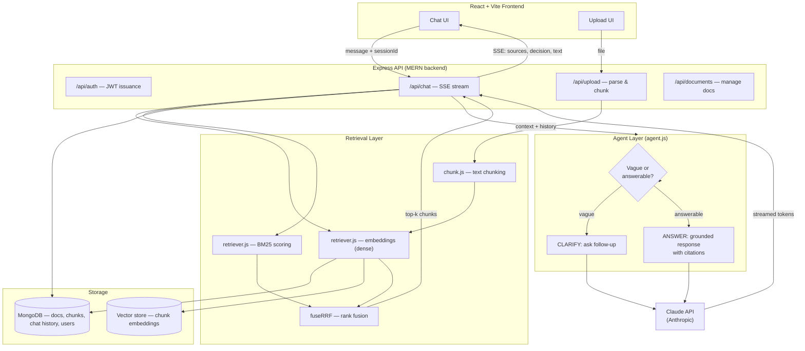

# RAG Notes Chat

Full-stack Retrieval-Augmented Generation (RAG) app that lets you upload your own notes/PDFs and chat with an AI agent grounded strictly in that content — with citations, hybrid retrieval, and a small agentic decision layer that asks clarifying questions instead of guessing.

Built to demonstrate practical RAG + agent + LLM-integration skills end-to-end: chunking, hybrid retrieval (dense + BM25 + RRF fusion), grounded generation, streaming, and a MERN-based full-stack app around it.

---

## Table of Contents

- [Features](#features)
- [Architecture](#architecture)
- [Tech Stack](#tech-stack)
- [How Retrieval Works](#how-retrieval-works)
- [How the Agentic Layer Works](#how-the-agentic-layer-works)
- [Getting Started](#getting-started)
- [Environment Variables](#environment-variables)
- [API Reference](#api-reference)
- [Project Structure](#project-structure)
- [Roadmap](#roadmap)
- [License](#license)

---

## Features

- 📄 **Document ingestion** — upload `.txt`, `.md`, or `.pdf` files; text is extracted, chunked, and embedded
- 🔍 **Hybrid retrieval** — combines dense vector similarity and BM25 keyword scoring, fused via Reciprocal Rank Fusion (RRF)
- 🤖 **Agentic decision step** — before answering, the model decides whether the query is answerable from context or too vague, and asks a clarifying question when needed
- 📚 **Citation-grounded answers** — every claim is tied back to a specific retrieved chunk (`[1]`, `[2]`, …), and the model is instructed to say "I don't know" rather than hallucinate
- ⚡ **Streaming responses** — answers stream token-by-token over Server-Sent Events (SSE), including a separate `sources` event so the UI can show citations before the answer finishes
- 🔐 **JWT-based auth** — per-user documents, chunks, and chat history
- 🗂️ **Document management** — list, search (keyword), preview, rename/tag, and delete uploaded documents
- 💬 **Persistent chat history** — sessions are stored per user and replayed as context on follow-up turns

---

## Architecture



**Request flow for a chat message:**

1. Frontend sends `{ message, sessionId }` to `POST /api/chat`.
2. Backend persists the user message, then retrieves the top-k chunks using hybrid search (dense cosine similarity + BM25, fused with RRF).
3. Chat history for the session is loaded and passed along for multi-turn context.
4. Retrieved chunks + history + the current question go to `agent.js`, which calls the Claude API with a system prompt instructing it to either `CLARIFY:` or `ANSWER:` (citing chunks inline).
5. The backend streams `sources`, `decision`, and `text` events over SSE as they arrive.
6. The final assistant message is persisted to chat history once the stream ends.

---

## Tech Stack

| Layer | Tech |
|---|---|
| Frontend | React, Vite |
| Backend | Node.js, Express |
| Database | MongoDB |
| LLM | Claude API (Anthropic) |
| Retrieval | Dense embeddings + BM25, fused with Reciprocal Rank Fusion |
| File parsing | `pdf-parse` for PDFs |
| Auth | JWT |
| Transport | Server-Sent Events (SSE) for streaming |
| Deployment | Vercel (frontend) + Render/Railway (backend) |

---

## How Retrieval Works

Retrieval is **hybrid**, not pure vector search:

1. **Dense retrieval** — the query is embedded and compared via cosine similarity against every chunk's embedding.
2. **BM25 retrieval** — a classic sparse keyword-based ranking is computed over the same chunk set, catching exact-term matches dense retrieval can miss (names, numbers, rare terms).
3. **RRF fusion** — both ranked lists are merged using Reciprocal Rank Fusion, which combines rankings without needing to normalize dissimilar score scales.
4. The top-k fused chunks are passed into the prompt as context.

This is evaluated with an offline script measuring **Precision@k, Recall@k, MRR, and nDCG@k** against a labeled query set, so retrieval quality changes can be benchmarked instead of eyeballed.

---

## How the Agentic Layer Works

Rather than always answering directly, the system prompt asks Claude to first make a lightweight routing decision:

- If the question is **too vague or ambiguous** to retrieve/answer well (e.g. "tell me more," "what about the other part") → respond with a short clarifying question, prefixed `CLARIFY:`.
- Otherwise → answer **strictly from the retrieved context**, prefixed `ANSWER:`, citing chunk numbers inline (e.g. `[1]`). If the context doesn't contain the answer, it says so instead of guessing.

The backend parses this prefix from the streamed output to decide whether to render the reply as a clarifying question or a grounded answer, without needing a separate model call.

---

## Getting Started

### Prerequisites
- Node.js 18+
- MongoDB instance (local or Atlas)
- An Anthropic API key

### Installation

```bash
git clone https://github.com/kmlikithkumar/rag-notes-chat.git
cd rag-notes-chat

# backend
cd server
npm install
cp .env.example .env   # fill in ANTHROPIC_API_KEY, MONGODB_URI, JWT_SECRET
npm run dev

# frontend
cd ../client
npm install
npm run dev
```

Backend runs on `http://localhost:5050`, frontend on Vite's default `http://localhost:5173`.

---

## Environment Variables

| Variable | Description |
|---|---|
| `ANTHROPIC_API_KEY` | Claude API key |
| `MONGODB_URI` | MongoDB connection string |
| `JWT_SECRET` | Secret used to sign auth tokens |
| `STORAGE_LIMIT_MB` | Per-user storage cap (default: 100) |
| `ANTHROPIC_DEBUG_PAYLOAD` | Set to `1` to log full request/response payloads for debugging |

---

## API Reference

| Method | Endpoint | Description |
|---|---|---|
| `POST` | `/api/auth/signup` | Create account, returns JWT |
| `POST` | `/api/auth/login` | Log in, returns JWT |
| `POST` | `/api/upload` | Upload & index a document |
| `GET` | `/api/documents` | List documents + storage usage |
| `GET` | `/api/documents/:docId/preview` | Preview extracted text |
| `PATCH` | `/api/documents/:docId` | Rename / retag a document |
| `DELETE` | `/api/documents/:docId` | Delete a document + its chunks |
| `GET` | `/api/search` | Keyword search across chunks |
| `POST` | `/api/chat` | Send a message, stream response via SSE |
| `GET` | `/api/chat/:sessionId` | Fetch chat history for a session |

---

## Project Structure

```
rag-notes-chat/
├── server/
│   ├── src/
│   │   ├── server.js        # Express app, routes
│   │   ├── agent.js         # Claude call + agentic decision logic
│   │   ├── retriever.js     # embeddings, BM25, RRF fusion
│   │   ├── chunk.js         # text chunking
│   │   └── store.js         # MongoDB data access
│   └── eval/
│       └── run-eval.js      # retrieval quality benchmark
└── client/
    └── src/
        ├── components/
        │   ├── ChatWindow.jsx
        │   └── UploadPanel.jsx
        └── App.jsx
```

---

## Roadmap

- [ ] Swap keyword `/api/search` for hybrid semantic search
- [ ] Add per-document toggle to scope chat to a single file
- [ ] Support `.docx` uploads
- [ ] Add streaming retry/backoff on transient API failures
- [ ] Add eval CI step to catch retrieval regressions

---

## License

MIT
